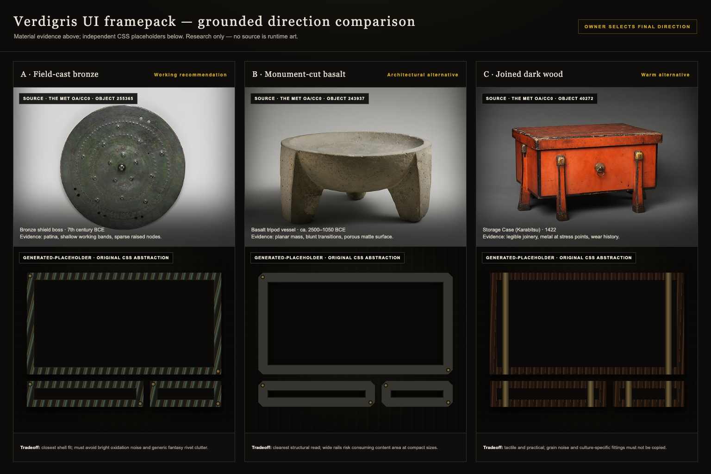

# Verdigris UI framepack research

Status: exploratory recommendation, not final art direction

Task: WIZARD-SURGE-001

Base: `0283e5876961c3dddb74ecef0f06f1c1df568d7a`

## Decision boundary

This audit compares material, corner, edge, and ornament systems for the
shared WIZARD framepack. It does not select production art. The owner retains
authority over material language and ornament density. All implementation
must preserve the frozen `.wizard-frame` interface in
[`UI_FRAMEPACK_INTERFACE.md`](../UI_FRAMEPACK_INTERFACE.md), including a
usable CSS/SVG fallback when images do not load.

`OWNER-INPUT-001` is open as [GitHub issue
#65](https://github.com/alexkorol/WIZARD/issues/65). At the time of this audit
it contains the complete direction-selection prompt but no generated image,
owner selection, or comment. The prompt can therefore be evaluated; its
visual output cannot yet be judged. The prepared correction round is in
[`OWNER_INPUT_CORRECTION_001.md`](OWNER_INPUT_CORRECTION_001.md) and remains
intentionally gated on a real output and rubric failure.

## Existing WIZARD evidence

WIZARD already has a coherent shell vocabulary without a centralized visual
asset pack:

- The dashboard uses near-black surfaces, warm ivory text, restrained gold,
  hairline rules, Cinzel headings, and Source Sans body copy in
  [`index.html`](../../index.html). These are the common laboratory baseline,
  not a command to erase module-specific palettes.
- Vesselforge uses a 512x512 ornate border image, a 473x112 divider, and a
  256x256 slot texture. The frame is applied with a 118px source slice and
  `stretch` edges in [`tools/rpg_inventory/index.html`](../../tools/rpg_inventory/index.html).
  This proves that a nine-slice-like runtime is viable, but its dense gold
  filigree is a module artifact rather than shared art direction.
- Vessels of Life & Mana already separates color, alpha/mask, normal,
  depth/AO, roughness/material, and stone plates; see its
  [`README.md`](../../tools/wizard_orbs/README.md). This supports the frozen
  derivative roles, but generated normal maps remain untrusted until locally
  verified.
- Verdigris World Presentation uses dark stone, copper, and verdigris as
  procedural materials in
  [`styles.css`](../../tools/verdigris_splash/styles.css). Its cool cyan focus
  color demonstrates that the shared pack must tolerate contextual accents.

The useful common denominator is therefore **dark, low-glare structure with
warm metal hierarchy and bounded oxidation**, not one mandatory ornamental
motif.

## Source and reuse policy

The three photographic tiles in the comparison sheet are research references,
not runtime assets. They are public-domain images supplied by The Metropolitan
Museum of Art under its [Open Access / CC0
policy](https://www.metmuseum.org/hubs/open-access). The Met object pages and
API both mark each selected work public domain. Local copies live only under
`evidence/visual/framepack-research/sources/` with hashes and source URLs in
`SOURCES.json`.

Translation is deliberately limited to material behavior, edge scale,
construction logic, and ornament density. No culture-specific form, sacred
object identity, figurative motif, or exact decoration is proposed for the
runtime pack.

## Direction A — Field-cast bronze

**Research source:** The Met, [Bronze shield boss, object
255365](https://www.metmuseum.org/art/collection/search/255365), Italic,
7th century BCE, bronze, public domain.

**Observed evidence:** a dark green-black bronze field; shallow concentric
working bands; sparse raised nodes; small irregular wear; strong silhouette
without high-relief carving.

**Frame translation:**

- Corners: compact, shallow folded or riveted caps; no oversized rosettes.
- Edges: narrow hammered band with a stable material scale across panel sizes.
- Ornament density: low; one irregular tool mark or rivet cluster may break
  symmetry without becoming an icon.
- Maps: alpha, edge, material, height, roughness-source, and normal-source.
  Emissive is absent unless the owner explicitly adds it later.

**Tradeoff:** closest to the existing black/gold shell and Bronze Age item
language, but it can become generic fantasy bronze if the oxidation is painted
as bright green noise or the rivets become decorative clutter.

**Exploratory recommendation:** advance this as the working comparison
baseline because it changes the existing shell least and leaves module content
dominant. This is a recommendation for the owner to evaluate, not a final
selection.

## Direction B — Monument-cut basalt with bronze pins

**Research source:** The Met, [Basalt tripod vessel or mortar, object
243937](https://www.metmuseum.org/art/collection/search/243937), Cypriot,
ca. 2500-1050 BCE, basalt, public domain.

**Observed evidence:** broad planar supports; blunt transitions; porous matte
surface; mass expressed by silhouette rather than decoration.

**Frame translation:**

- Corners: clipped monolithic blocks with shallow bevels.
- Edges: wider, quieter stone rails interrupted only by small structural
  bronze pins.
- Ornament density: very low; geometry and material breakup carry the read.
- Maps: alpha, edge, material, height, depth, roughness-source, and
  normal-source.

**Tradeoff:** strongest architectural identity and excellent content
separation, but wide stone rails consume small-card space and can make buttons
feel heavy. The gallery should test this direction at the smallest allowed
component size before it advances.

## Direction C — Joined dark wood with bronze straps

**Research source:** The Met, [Storage Case (Karabitsu), object
40272](https://www.metmuseum.org/art/collection/search/40272), Japan, 1422,
wood with black/red lacquer and gilt-bronze fittings, public domain.

**Observed evidence:** a clear box structure; thin metal fittings located at
joins; surface history visible through wear; ornament subordinate to useful
construction.

**Frame translation:**

- Corners: legible lap joints or end grain contained by narrow bronze straps.
- Edges: warm smoked wood rails with metal only at stress points.
- Ornament density: low to moderate, expressed by joinery rather than symbols.
- Maps: alpha, edge, material, height, roughness-source, and normal-source.

**Tradeoff:** warmer and more tactile than the current laboratory shell, but
wood grain can become noisy at small sizes and specific lacquer color or
culture-specific fittings must not be copied. The placeholder intentionally
uses neutral smoked wood rather than the source object's red lacquer.

## Direction D — Cold skymetal (deferred comparison)

`OWNER-INPUT-001` includes raw dark skymetal with blue-grey wear as a fourth
direction. It is genuinely distinct, but it has weaker grounding in the
existing shared shell than the three directions above and no physical source
tile in this audit. Keep it in the owner's generated contact sheet as a
control; do not promote it merely because it appears cleaner or more
technical. A skymetal choice would need a separate decision about whether the
shared laboratory may visually inherit a rare in-world material.

## Comparison

| Direction | Existing-shell fit | Small-component risk | Ornament control | Primary risk |
|---|---|---|---|---|
| A. Field-cast bronze | High | Low | Low, bounded | Generic fantasy bronze or noisy verdigris |
| B. Monument-cut basalt | Medium | High | Very low | Rails consume content area |
| C. Joined dark wood | Medium | Medium | Joinery-led | Grain noise or unintended cultural copying |
| D. Cold skymetal | Low/unknown | Low | Very low | Product/lore decision disguised as styling |

The contact sheet below pairs each grounded source with an independently drawn
placeholder abstraction. Placeholder tiles are not generated by an image
model and contain no copied source pixels.

## OWNER-INPUT-001 prompt evaluation

The issue packet satisfies the required owner-input shape:

- it asks one material/ornament decision and recommends restrained forged
  bronze while naming three alternatives;
- it says only final raster art is blocked;
- it specifies GPT Image-2, four variants, 1536x1024, 3:2, and an opaque
  charcoal background;
- it forbids text, symbols, fake alpha, excessive filigree, perspective,
  glow, and content inside the frames;
- it names deterministic source files, derivative roles, local
  post-processing, and continuation work.

Two points must be checked against the actual output rather than assumed:

1. A four-quadrant image may change component scale between quadrants despite
   the prompt. Scale mismatch is a correction-round failure, not permission to
   pick the most flattering tile.
2. A direction board can suggest modularity but cannot prove repeatable edges,
   clean alpha, or valid slice coordinates. Those are component-sheet and
   gallery gates.

Until an owner image exists, `OWNER_INPUT_CORRECTION_001.md` must remain
`PENDING_OUTPUT`; running it early would violate the rule that correction
rounds address observed failures rather than broad rerolls.

## Acceptance rubric for the next review

When the owner attaches output, record the raw filename, dimensions, SHA-256,
and issue/comment URL before judging it. Then verify:

1. four materially distinct directions use the same panel/card/button set;
2. components are straight-on and materially comparable at consistent scale;
3. centers remain uninterrupted and ornament stays subordinate;
4. corners and edges plausibly separate into nine-slice regions;
5. no text, glyph, logo, heraldry, figurative motif, fake alpha, glow, or
   perspective scene appears;
6. only failed rubric items enter the correction round.

No reference image in this audit is approved for a runtime pack, and no final
art authority is asserted.
