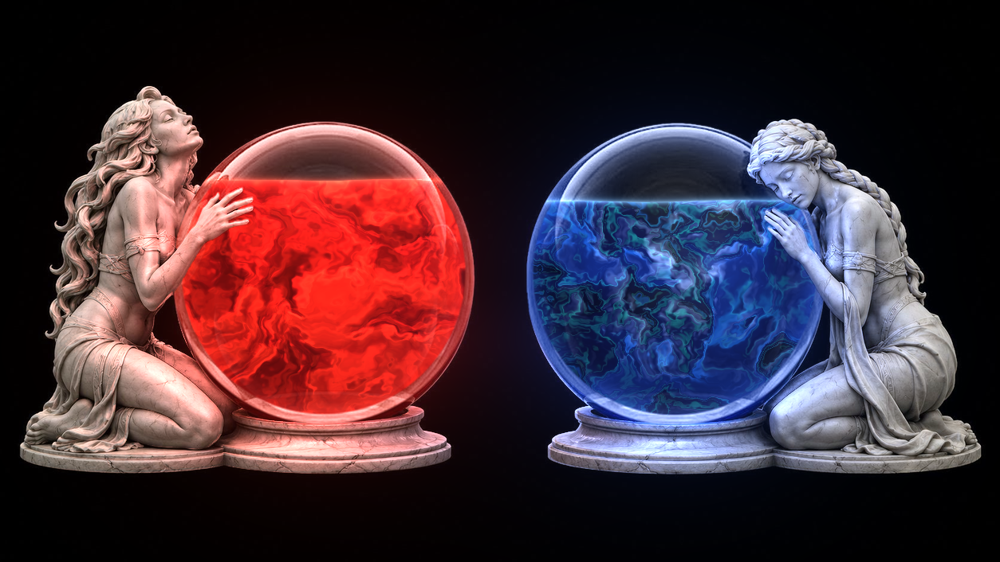
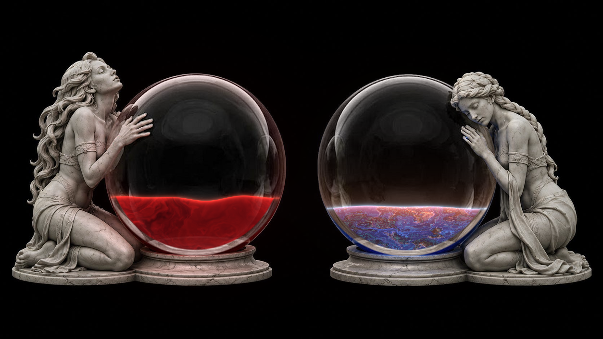
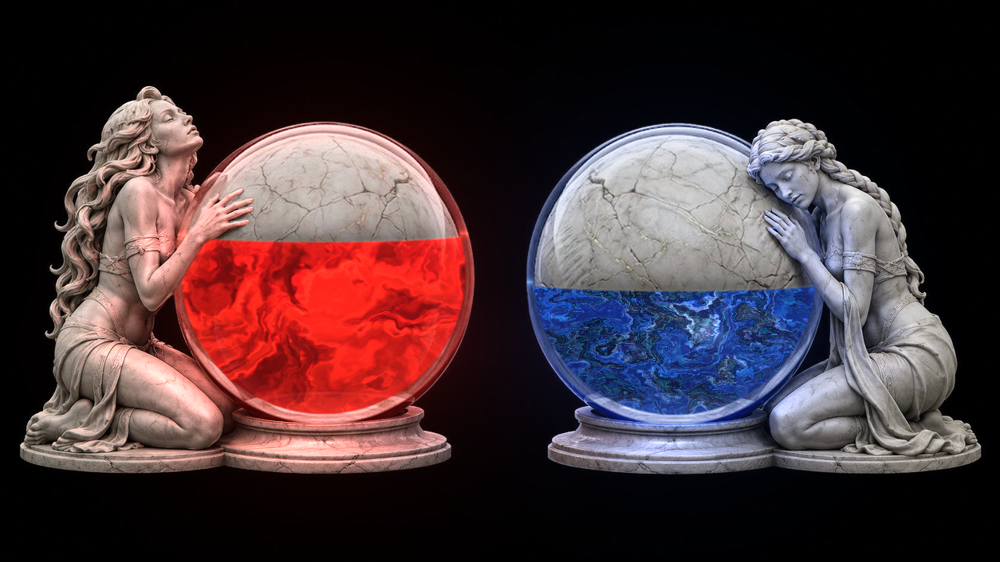

# Vessels of Life & Mana — ARPG Orb Engine

A real-time WebGL2 health/mana globe system for action-RPG interfaces. One fullscreen
fragment shader composites live procedural liquids, dynamic relighting, and a full
status-effect simulation into a set of pre-rendered art plates.



**Live demo:** [alexkorol.github.io/WIZARD/tools/wizard_orbs](https://alexkorol.github.io/WIZARD/tools/wizard_orbs/) — or just open `index.html`; it's fully self-contained.

**Predecessor:** the fully procedural [Health Globe v1](../health_globe/index.html) — kept in the toolbox as a before/after comparison of asset-driven vs. from-scratch generation.

## What it does

**Life globe** — opaque blood rendered as ink-plumes in water: domain-warped billow
fields with lit curl edges and shadowed undersides, a layered red palette (maroon →
crimson → scarlet), subtle vein filaments, and a depth layer of plumes drifting behind.
As health drains, a heartbeat takes over: BPM ramps 42→168, each beat fires a lub-dub
brightness pulse, a pressure ring, agitated surface chop, and anime-style splash
droplets with breaking crown rings.

**Mana globe** — a brooding malachite nebula with an ambiguous wisp-moon drifting
inside the liquid, backlighting the clouds: density-gradient silver linings,
intermittent god rays, and shampoo-glitter micro-sparkles with cross flares. As mana
drains the moon sets at the surface (warm afterglow, occasional green flash) and the
nebula **condenses** — folding in on itself with rising warp and self-folding
convolutions, conserving its detail into the shrinking volume; it rehydrates and
straightens as mana returns.



**Simulation** — poison (wears off, ticks damage, turns the blood toxic green), bleed
stacks (8s each, hemorrhage clouds + rivulets running down the inside of the glass),
reservation sliders on both orbs (the reserved volume becomes the carved-stone plate,
with underside shadow and a caught-light seam; surfaces pin flat against the cap),
slosh impulses, event flashes, full-charge blooms, and a scripted boss fight.



**Statue relighting** — a normal map drives per-orb point lights whose height rides
the liquid surface, with AO-gated diffuse/speculars, a material split from the
roughness plate (polished darker skin vs. matte lighter drapery), a traveling sheen,
and status-tinted light (poisoned blood lights the goddess green).

## Controls

| Input | Action |
|---|---|
| `1` / `2` / `3` | Take hit / heavy blow / potion (clears bleed) |
| `4` / `5` | Apply poison / add bleed stack |
| `Q` / `W` / `E` (hold) | Cast bolt / elixir / channel |
| `R` / `Space` | Restore all / boss fight |
| Sliders | Direct level control + per-orb reservation 0–100% |

## Architecture

- **Single pass.** One WebGL2 fullscreen triangle; everything happens in
  `src/orb.frag`. Six texture inputs, no framebuffers, no three.js.
- **Plates.** `src/assets/` holds the aligned art plates: color art, orb mask
  (handles statue-hand occlusion), normal map, empty-glass plate (real glass
  composited behind/over the liquid), packed depth+AO, and the petrified-stone plate.
  All were AI-generated from the same scene and aligned by silhouette-IoU optimization.
- **Level mapping.** Volume-true spherical-cap fill in the mid-range, blended into a
  constant-speed linear mapping near the poles so the surface never sprints through
  the dome (sphere geometry makes naive volume mapping diverge there).
- **Quality tiers.** Ultra/High/Performance switch fbm octave count, resolution
  scale, and DPR cap. Pauses when the tab is hidden; respects reduced-motion.

## Build

`index.html` is the build artifact — fully self-contained. To rebuild after editing
the shader or template:

```bash
python3 build.py
```

Optional shader sanity check: `glslangValidator -S frag src/orb.frag`.

## Deploy

This module lives inside the [WIZARD](https://github.com/alexkorol/WIZARD) toolbox and
ships with the rest of the site from the `gh-pages` branch. Since `index.html` is fully
self-contained, it can also be dropped anywhere as a single file.
